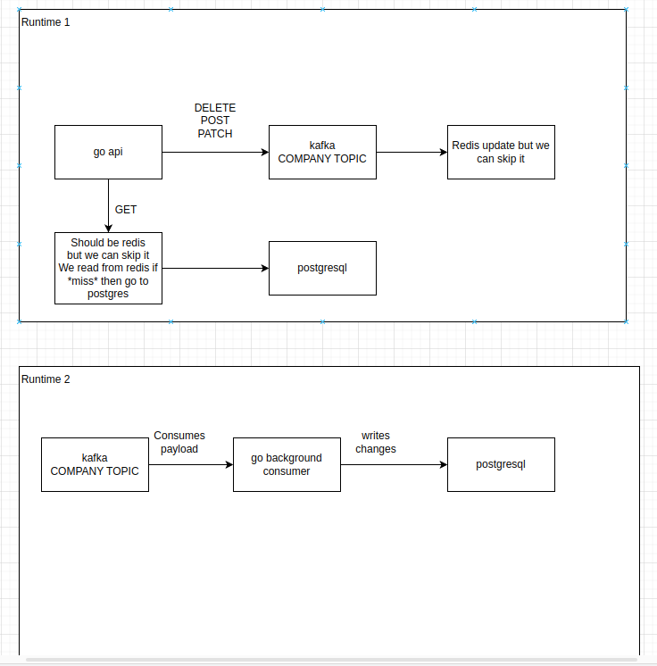

Prerequisites for local environment:
- Considering you have got a Linux/MacOS local environment
- Install `docker`, `docker-compose` with Compose file format v3.9 and `build-essential` packages (+ add current user to group `docker`)
- git clone project
- cd to cloned project
- make command `cp .env.example .env`

Usage:
- run `make init` to create containers and application
- use 2345 port for remote debug with air+delve
- all documentation is available here: http://localhost:8081/api/v1/documentation/
- health check here: http://localhost:8081/api/v1/health/
- `make docs` is used to regenerate structures out of OpenApi yaml files
- `make lint` is used to run linters via golangci-lint package
- Simple (but not complete) scheme 
- And do not forget to add 'Bearer ' before access token in requests